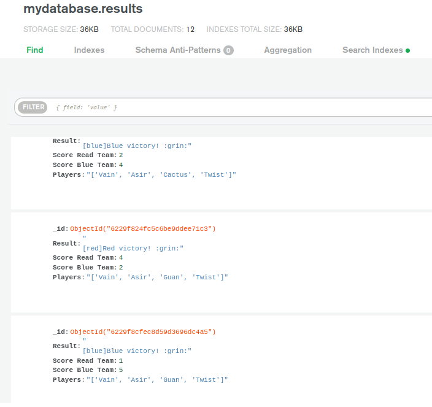

Navn: Edyta Bredla

Gruppe 51

### How to run:

`Python 3.10 required`

1. Download repository and unpack.
2. Nagigate to folder containing files `cd /path/to/file`
3. Run server in cli `python3.10 server.py`
4. Run two clients `python3.10 client.py`
5. `Player 2` is waiting for `Player 1` to select his team members. 
6. `Player 2` can select team members
7. Server returns result to each `Player` 
8. Game rounds are decided to be visible on server side. Players get only final result. 

### Known bugs

1. Second client has to wait for first player's input.(Way to be sure that they will not pick up the same champions).
2. When game is over (Players sockets are closed) server returns error. 😖

### MongoDB Atlas

1. Create `mongoDB Atlas` as it is shown in tutorial on `mitt.uib.no`, remember to define correct `Network Access`
2. Create `.env` file which defines `MongoClient`: [Standard Connection String Format](https://docs.mongodb.com/manual/reference/connection-string/)
3. Data saved in mongoDD atlas should look as followed:
4. 

